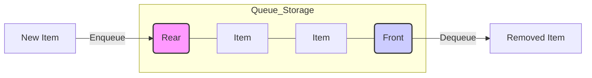

# 📘 Topic: The Queue Data Structure
### "The FIFO Principle" (First-In, First-Out)

Imagine a **Queue** as a line of people waiting for a movie ticket. The first person to stand in line is the first one to get the ticket and leave.

---

## 1. 🖼️ The Visual Concept
Think of a Queue like a **Pipe**. One end is for entering, and the other is for exiting.

```text
      ADD HERE (Rear)                                REMOVE HERE (Front)
      📥 ENQUEUE                                          📤 DEQUEUE
    +-------------------------------------------------------------+
    |  [ 50 ]  |  [ 40 ]  |  [ 30 ]  |  [ 20 ]  |  [ 15 ]  |  [ 10 ]  |  ---> EXIT
    +-------------------------------------------------------------+
       Newest                                                Oldest
        Item                                                  Item
```

---

## 2. 🔑 Key Terminology
To understand Queues, you must know these **four** terms:

*   **Front (Head) 👤:** The very first item in the queue (the one about to be removed).
*   **Rear (Tail) 🍑:** The last item in the queue (the one most recently added).
*   **Enqueue ➕:** The act of adding an item to the **Rear**.
*   **Dequeue ➖:** The act of removing an item from the **Front**.

---

## 3. 🛠️ Operations Explained (Step-by-Step)

### A. The Enqueue Operation (Adding)
When you add an item, the **Rear** changes.

| Step | Action | Queue State | Front | Rear |
| :--- | :--- | :--- | :--- | :--- |
| 1 | `Enqueue(10)` | `[10]` | 10 | 10 |
| 2 | `Enqueue(20)` | `[10, 20]` | 10 | 20 |
| 3 | `Enqueue(30)` | `[10, 20, 30]` | 10 | 30 |

**Visual Logic:**
`[Front: 10] <- [20] <- [Rear: 30] 📥 (Adding 40 here)`

---

### B. The Dequeue Operation (Removing)
When you remove an item, the **Front** changes. The oldest item leaves first!

| Step | Action | Queue State | Item Removed | New Front |
| :--- | :--- | :--- | :--- | :--- |
| 1 | `Dequeue()` | `[20, 30]` | **10** | 20 |
| 2 | `Dequeue()` | `[30]` | **20** | 30 |

**Visual Logic:**
`📤 (10 Leaves) <- [Front: 20] <- [Rear: 30]`

---

## 4. 📊 Utility Functions
These are "helper" functions to check the status of your Queue:

*   **`isEmpty()` ❓:** Checks if the queue has 0 items. 
    *   *If Queue is empty* ➡️ Returns **True**
    *   *If Queue has items* ➡️ Returns **False**
*   **`size()` 📏:** Counts the number of items. 
    *   Example: `[10, 20, 30]` ➡️ `size = 3`
*   **`getFront()` 👀:** Just "peeks" at the front item without removing it.
*   **`getRear()` 🏁:** Just "peeks" at the last item added.

---

## 5. 💡 Teacher's "Extra Mile" (Pro-Tips)

### Why use a Queue?
1.  **Printer Tasks 🖨️:** When you send 5 documents to a printer, it prints the first one you sent first. That’s a Queue!
2.  **Web Servers 🌐:** When thousands of people visit a website at once, the server puts them in a "Queue" to handle requests one by one.
3.  **CPU Scheduling 💻:** Your computer runs many programs. It uses Queues to decide which task the processor should handle next.

### ⚠️ A Note on Efficiency (Big O)
In a good Queue implementation:
*   **Enqueue** is $O(1)$ (Super fast!)
*   **Dequeue** is $O(1)$ (Super fast!)
*   This means it doesn't matter if you have 10 items or 10 million items; adding and removing happens instantly.

---

## 📝 Summary Diagram



**Final Rule to Remember:** 
> **"First one in the line, first one to the finish line!"** 🏁