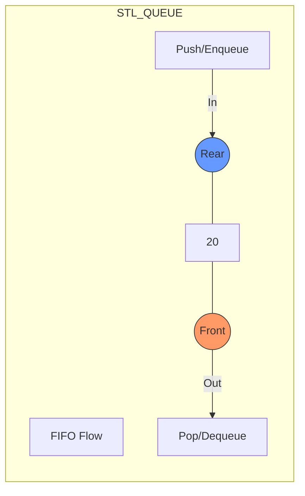

# 📦 The C++ STL Queue

### "The Industry Standard"

To use a Queue in your C++ project, you need these two lines at the top:
```cpp
#include <queue>      // The library
using namespace std; // So you don't have to write std::queue
```

---

# 1. 🛠️ Key Operations (The Dictionary)
One thing that confuses students is that the names in STL are different from academic textbooks. Here is the "Translation Manual":

| Academic Term | STL Function | Action | Result |
| :--- | :--- | :--- | :--- |
| **Enqueue** | `push(x)` | Adds item to the **Back** | 📥 |
| **Dequeue** | `pop()` | Removes item from the **Front** | 📤 |
| **Get Front** | `front()` | Looks at the first item | 👀 |
| **Get Rear** | `back()` | Looks at the last item | 🏁 |
| **Size** | `size()` | Returns number of items | 📊 |
| **Is Empty** | `empty()` | Returns true/false | ❓ |

---

# 2. 🚶‍♂️ Step-by-Step Code Example
Let's see how the queue changes after every line of code.

```cpp
#include <iostream>
#include <queue>
using namespace std;

int main() {
    queue<int> q; // Creates an empty queue

    q.push(10); // Queue: [10]
    q.push(20); // Queue: [10, 20]
    q.push(30); // Queue: [10, 20, 30]

    cout << "Front: " << q.front() << endl; // Prints 10
    cout << "Back: " << q.back() << endl;   // Prints 30

    q.pop(); // Removes 10! Queue is now: [20, 30]

    cout << "New Front: " << q.front() << endl; // Prints 20
    
    return 0;
}
```

---

# 3. 🔄 How to Traverse a Queue
In a Queue, you can't just jump to the middle. To see all elements, you must **process and remove** them.

```cpp
while (q.empty() == false) {
    cout << q.front() << " "; // Print the first person
    q.pop();                  // Remove them so we can see the next one
}
// ⚠️ Warning: After this loop, your queue will be empty!
```

---

# 4. ⚙️ Under the Hood (Advanced Info)
The STL Queue is called a **"Container Adapter."** This means it doesn't store data itself; it uses another container (like a `deque` or `list`) and gives it a "Queue interface."

### ⏳ Time Complexity
Every single operation mentioned (`push`, `pop`, `front`, `empty`) takes **$O(1)$ Time**. 
This means whether you have 10 items or 10 billion items, the speed is exactly the same! ⚡

### 🧱 Underlying Containers
By default, `std::queue` uses `std::deque`.
*   **Can we use `std::list`?** ✅ Yes!
*   **Can we use `std::vector`?** ❌ **NO.** 
    *   *Why?* Because a vector is bad at removing items from the front (`pop_front`). It would take $O(n)$ time to shift all items. A Queue **must** be $O(1)$.

---

# 🖼️ Visual Summary Diagram



---

# 💡 Teacher's Pro-Tips for Interviews

1.  **The Pop Difference:** Remember that `q.pop()` in C++ **does not return the value**. It just deletes it. You must call `q.front()` first to save the value, then call `q.pop()`.
2.  **Stack vs Queue:** 
    *   **Stack:** `push()` and `pop()` happen at the **Same End** (LIFO).
    *   **Queue:** `push()` and `pop()` happen at **Opposite Ends** (FIFO).
3.  **Use Case:** Use a Queue whenever you see "First-Come, First-Served" or "Processing in Order."

