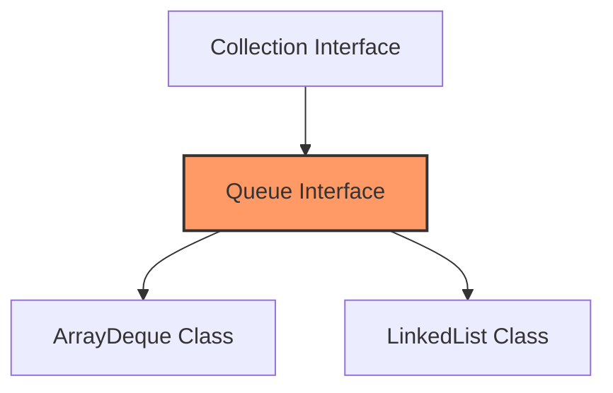

# ☕ Java Queue: The Interface Approach

In Java, `Queue` belongs to the **Java Collections Framework**. Think of the Queue as a **Contract** 📜. If a class signs this contract, it must provide specific FIFO behaviors.

### 🗺️ The Family Tree (Hierarchy)


---

## 1. ⚔️ The Two Ways to Implement
When you create a Queue in Java, you usually choose between these two powerhouses:

| Feature | `ArrayDeque` 🎡 (Recommended) | `LinkedList` 🔗 |
| :--- | :--- | :--- |
| **Structure** | Resizable Array | Doubly Linked List |
| **Speed** | **Faster** (Cache-friendly) | Slightly Slower (Pointer overhead) |
| **Complexity** | **Amortized $O(1)$** | **Worst-case $O(1)$** |
| **Memory** | Low overhead | High (Needs extra space for pointers) |

> **Teacher's Tip:** Use `ArrayDeque` for most cases. Use `LinkedList` only if you need a guaranteed $O(1)$ even in the worst-case scenario (avoiding the rare array resize).

---

## 2. 🚦 The Two Faces of Queue Methods
Java gives you **two versions** for every operation. One is "Safe" (returns a value), and the other is "Strict" (throws an exception).

| Action | **Safe Version** (Returns Null/False) | **Strict Version** (Throws Exception) |
| :--- | :--- | :--- |
| **Insert (Rear)** | `offer(e)` 📥 | `add(e)` ➕ |
| **Remove (Front)** | `poll()` 📤 | `remove()` ➖ |
| **Examine (Front)** | `peek()` 👀 | `element()` 🔍 |

### 💡 Why two versions?
*   Use the **Safe Version** (`offer`, `poll`, `peek`) if you are working with a **Capacity-Restricted** queue. If the queue is full/empty, your program won't crash; it will just return `null` or `false`.
*   Use the **Strict Version** if you want the program to shout (throw an error) if something goes wrong.

---

## 3. 💻 Java Code in Action

```java
import java.util.*;

public class JavaQueueDemo {
    public static void main(String[] args) {
        // We use Queue interface as the reference type
        Queue<Integer> q = new ArrayDeque<>(); 

        // 1. Adding items
        q.offer(10);
        q.offer(20);
        q.offer(30);

        // 2. Look at the front item
        System.out.println("Front item (Peek): " + q.peek()); // 10

        // 3. Remove item
        System.out.println("Removed (Poll): " + q.poll()); // 10 removed

        // 4. Check status
        System.out.println("Queue size: " + q.size()); // 2
        System.out.println("Is it empty? " + q.isEmpty()); // false

        // 5. Printing the whole queue
        System.out.println("Remaining items: " + q); // [20, 30]
    }
}
```

---

## 4. 🧠 Understanding "Amortized" $O(1)$
The transcript mentioned `ArrayDeque` is **Amortized $O(1)$**. What does that mean?
*   **Most of the time:** Adding an item is super fast ($O(1)$).
*   **Rarely:** When the array is full, Java has to create a new, bigger array and copy everything over ($O(n)$).
*   **Average:** If you take 1000 operations, the average time is still $O(1)$.

---

## 🌍 5. Real-World Applications

*   **⚡ Synchronization:** Between a fast device (Processor) and a slow device (Keyboard). The Queue acts as a buffer so the processor doesn't have to wait for your slow typing!
*   **🤝 Resource Sharing:** 
    *   **CPU Scheduling:** Multiple apps wanting to use the one CPU.
    *   **Printers:** Multiple documents waiting for one printer.
*   **🌐 Networking:** Routers use queues to store data packets arriving from a fast network before sending them to a slower one.

---

## 📝 Teacher's Final Summary
1.  **Queue is an Interface** in Java.
2.  Use **`ArrayDeque`** for better performance.
3.  **`offer`, `poll`, `peek`** are your "Safe" friends (no exceptions!).
4.  Queues are the backbone of **First-Come, First-Served** logic in systems.

**You've officially conquered Queues in C++, C, and Java!** 🏆 How are you feeling? Ready to move to **Priority Queues** or perhaps **Stacks**? 🚀🌟