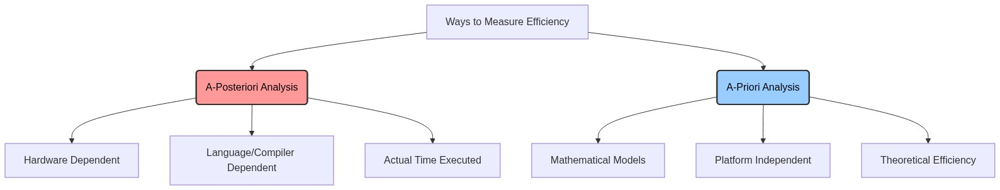
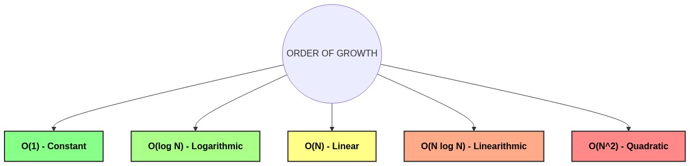

# Analysis of Algorithms (Background)

[⬅️ Back to Table of Contents](Table%20Of%20Contents.md)

---

## 🎥 Video Notes

### Why do we need to analyze algorithms?
When finding a solution computationally, there can be multiple valid algorithms to solve a single problem. The **Analysis of Algorithms** helps us to determine which algorithm is the most efficient. 

Efficiency is primarily evaluated based on two parameters:
1. **Time Complexity:** How much time the algorithm takes to execute as the input size grows.
2. **Space Complexity:** How much auxiliary memory the algorithm consumes as the input size grows.

### The Problem with Measuring Absolute Execution Time

Measuring algorithm efficiency using a stopwatch or computationally is known as **A-posteriori analysis**. Measuring mathematically using equations is **A-priori analysis**.



> [!WARNING]
> A-posteriori analysis is flawed because absolute execution time is heavily influenced by:
> * 💻 **CPU Power** (Clock speed, Core counts)
> * 🧠 **RAM** (Available memory during execution)
> * 🛠️ **Programming Language** (e.g., C++ vs Python)
> * ⚙️ **Compiler Optimizations**
> * 🖥️ **Background OS Processes**

Therefore, absolute time doesn't give us the true theoretical efficiency of an algorithm. We need a mathematical, platform-independent way to express how an algorithm scales. This leads us to **A-priori analysis** (Asymptotic Analysis).

---

### Demonstrating Algorithmic Efficiency (C++ Example)

Let's take a classic problem: **Find the sum of the first `N` natural numbers.**

There are three typical ways to solve this. Let's look at the C++ implementations:

#### Method 1: Mathematical Formula (The most efficient)
```cpp
// Time Complexity: O(1) - Constant time
int findSum1(int n) {
    return n * (n + 1) / 2;
}
```
* **Analysis**: It performs exactly 3 operations (1 addition, 1 multiplication, 1 division) regardless of whether `n` is 10 or 1,000,000. It scales perfectly.

#### Method 2: Single Loop 
```cpp
// Time Complexity: O(N) - Linear time
int findSum2(int n) {
    int sum = 0;
    for(int i = 1; i <= n; i++) {
        sum = sum + i;
    }
    return sum;
}
```
* **Analysis**: The loop runs `N` times. If `N` grows a hundred times, the execution time also roughly grows a hundred times. 

#### Method 3: Nested Loops (The least efficient)
```cpp
// Time Complexity: O(N^2) - Quadratic time
int findSum3(int n) {
    int sum = 0;
    for(int i = 1; i <= n; i++) {
        for(int j = 1; j <= i; j++) {
            sum++;
        }
    }
    return sum;
}
```
* **Analysis**: The outer loop runs `N` times, and the inner loop runs `i` times. The total operations grow proportionally to $N^2$. For $N = 1000$, it executes rapidly. For $N = 1,000,000$, this will likely hang your program.

### Visual Comparative Summary



Here is how the number of operations roughly scales with different input sizes for each method:

| Input Size `(N)` | Method 1 `O(1)` | Method 2 `O(N)` | Method 3 `O(N²)` |
| :--- | :--- | :--- | :--- |
| **10** | 3 ops | 10 ops | 100 ops |
| **100** | 3 ops | 100 ops | 10,000 ops |
| **1,000** | 3 ops | 1,000 ops | 1,000,000 ops |
| **100,000** | 3 ops | 100,000 ops | 10,000,000,000 ops |

> [!TIP]
> By looking at the code structure rather than a stopwatch, we clearly see that **Method 1** is far superior to the others. Analyzing algorithms gives us a mathematical guarantee of this superiority.

