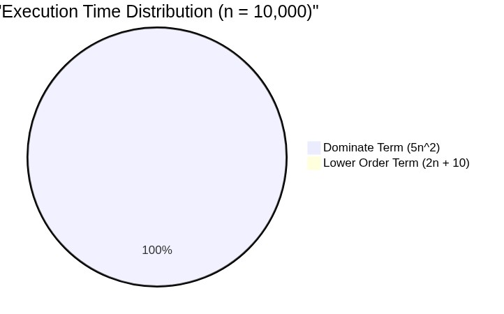

# Asymptotic Analysis

[⬅️ Back to Table of Contents](Table%20Of%20Contents.md)

---

## 🎥 Video Notes

### What is Asymptotic Analysis?
**Asymptotic Analysis** is the method of evaluating the performance of an algorithm in terms of the input size $n$. Specifically, we analyze how the time (or space) taken increases as the input size $n$ approaches infinity. 

We drop constant factors and lower-order terms to focus entirely on the main factor that dictates the algorithm's performance on large inputs.

### The Two Rules of Asymptotic Analysis
1. **Drop Lower Order Terms:** As input size $n$ becomes very large, the term with the highest degree will always dominate the calculation.
2. **Drop Constant Factors:** The exact number of operations doesn't matter as much as how the number of operations scales.

#### Example of Dropping Terms
Let's say after analyzing an algorithm line-by-line, we derive the exact time function:
$$f(n) = 5n^2 + 2n + 10$$

* `n` = 10 
  * $5(100) + 2(10) + 10 = 500 + 20 + 10 = 530$. The $n^2$ term accounts for ~94% of the time.
* `n` = 10,000
  * $5(100,000,000) + 20,000 + 10 = 500,000,000 + 20,000 + 10$. The $n^2$ term accounts for ~99.996% of the time.

As $n \to \infty$, the $2n + 10$ terms become completely insignificant. Therefore, we **drop the lower order terms**:
$f(n) \approx 5n^2$



Next, we **drop the constant multiplier** ($5$), because we only care about the *rate of growth*. 
The final Asymptotic expression is proportional to $n^2$.

### Formal Definition: Why it matters
Algorithms are designed to scale. If an algorithm works fast for 10 elements but takes a decade for a million elements, it is practically useless. Asymptotic analysis guarantees that we are filtering out noise (like hardware speed) and identifying the fundamental mathematical curve of our code.

```cpp
// Example: This function's exact operation count varies.
// But asynchronously, it involves iterating n times, and doing n inner operations.
// The complexity evaluated Asymptotically shrinks down to purely N * N.
void printPairs(int n) {
    for (int i = 0; i < n; i++) {         // Outer Loop -> N
        for (int j = 0; j < n; j++) {     // Inner Loop -> N
            cout << i << ", " << j << "\n"; // Basic Operation
        }
    }
}
// Asymptotic Complexity revolves solely around O(n^2).
```

