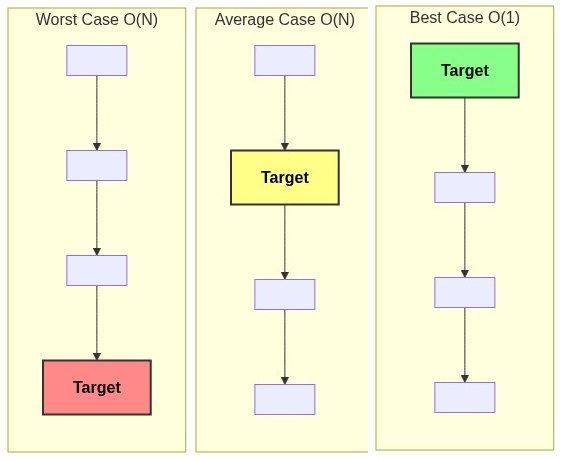

# Best, Average and Worst cases

[⬅️ Back to Table of Contents](Table%20Of%20Contents.md)

---

## 🎥 Video Notes

### Scenarios of Analysis
Algorithms don't just depend on the size of the input `n`, they also heavily depend on the **specific characteristics of the given input**. An algorithm might execute very quickly for one input of size `n`, but very slowly for a different input of the exact same size `n`.

Because of varying input conditions, we analyze algorithms across three distinct cases:

1. **Worst Case (Upper Bound):** 
   - The scenario where the algorithm takes the **maximum** possible amount of time. 
   - *Why do we care?* It provides an absolute guarantee. If you optimize your worst-case scenario, you know your software will *never* perform slower than that limit.

2. **Best Case (Lower Bound):** 
   - The scenario where the algorithm takes the **minimum** possible amount of time.
   - *Why do we care?* Often not very useful for practical performance planning (it's called "bogus analysis" sometimes), but good for theoretical lower limits or finding optimal early termination conditions.

3. **Average Case (Expected Bound):**
   - The scenario where the algorithm behaves across a random compilation of all possible inputs on average.
   - *Why do we care?* It provides a realistic expectation of everyday performance. Note that calculating Average Case is mathematically difficult as it involves computing the sum of running times across all permutations and dividing by total permutations.

---

### The Classic Example: Linear Search

Let's understand these cases clearly with the most straightforward algorithm in existence: **Iterative Linear Search**. We are given an array of size `N`, and we want to find a specific target value.

#### C++ Linear Search Implementation
```cpp
// Returns the index of the target if found, otherwise returns -1
int linearSearch(int arr[], int n, int target) {
    for(int i = 0; i < n; i++) {
        if(arr[i] == target) {
            return i; // Item found, early exit!
        }
    }
    return -1; // Item not found
}
```

#### The Three Cases for Linear Search:



1. **Best Case:** The `target` value is situated right at the **first index** `arr[0]`.
   - The loop runs exactly 1 time and returns immediately.
   - Complexity: **$O(1)$** (Constant time, no matter how large `N` is).

2. **Worst Case:** The `target` value is located at the **very last index** `arr[n-1]`, or worse, the `target` **does not exist** in the array at all.
   - The loop is forced to iterate through the entire array of size `N`, checking every single element.
   - Complexity: **$O(n)$** (Linear time).

3. **Average Case:** Assuming a uniform probability distribution where the target could be at any index with equal likelihood.
   - We might find it at index 0, or index 1, or index `N-1`. 
   - On average, we will have to search through half the array before finding it.
   - Average Operations = $N/2$. In Asymptotic notation, constants are ignored, so $N/2$ resolves to...
   - Complexity: **$O(n)$**.

### Caveat
In algorithmic interviews and software architecture planning, we generally concern ourselves overwhelmingly with the **Worst Case** to ensure our systems never bottleneck or crash unexpectedly.

