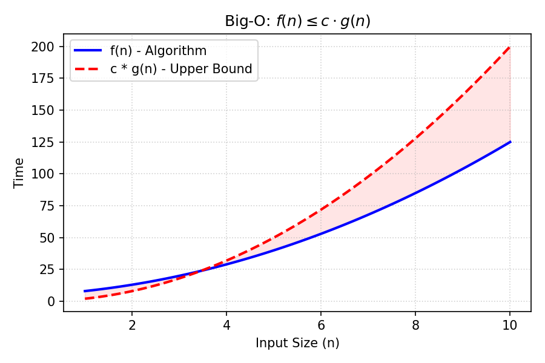

# Big O Notation

[⬅️ Back to Table of Contents](Table%20Of%20Contents.md)

---

## 🎥 Video Notes

### Big-O ($O$) - The Upper Bound
**Big-O** notation provides an upper bound on an algorithm's running time. 

**Definition:** 
$f(n) = O(g(n))$ if there exist positive constants $c$ and $n_0$ such that:
$0 \le f(n) \le c \cdot g(n)$ for all $n \ge n_0$.

**What it means:** 
Your algorithm $f(n)$ may run faster, but it will **never** grow faster than the curve $g(n)$ multiplied by some constant $c$. It establishes the guaranteed "worst-case" roof.

**Insight:** If a function is $O(N)$, it is technically also $O(N^2)$ and $O(N^3)$, because those are also upper bounds. However, we uniquely look for the **tightest** upper bound available when stating Big-O.

