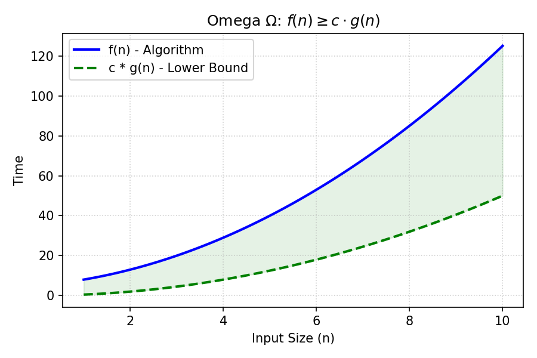

# Omega Notation

[⬅️ Back to Table of Contents](Table%20Of%20Contents.md)

---

## 🎥 Video Notes

### Omega ($\Omega$) - The Lower Bound
**Omega notation** provides a lower bound on an algorithm's running time.

**Definition:** 
$f(n) = \Omega(g(n))$ if there exist positive constants $c$ and $n_0$ such that:
$0 \le c \cdot g(n) \le f(n)$ for all $n \ge n_0$.

**What it means:**
Your algorithm $f(n)$ will **always** take *at least* this much time as it scales towards infinity. It is the guaranteed floor.

**Insight:** If you can mathematically prove a problem has an $\Omega(N \log N)$ lower limit (like comparison-based sorting), then you know it is physically impossible to invent an $O(N)$ comparison-based sorting algorithm ever.

