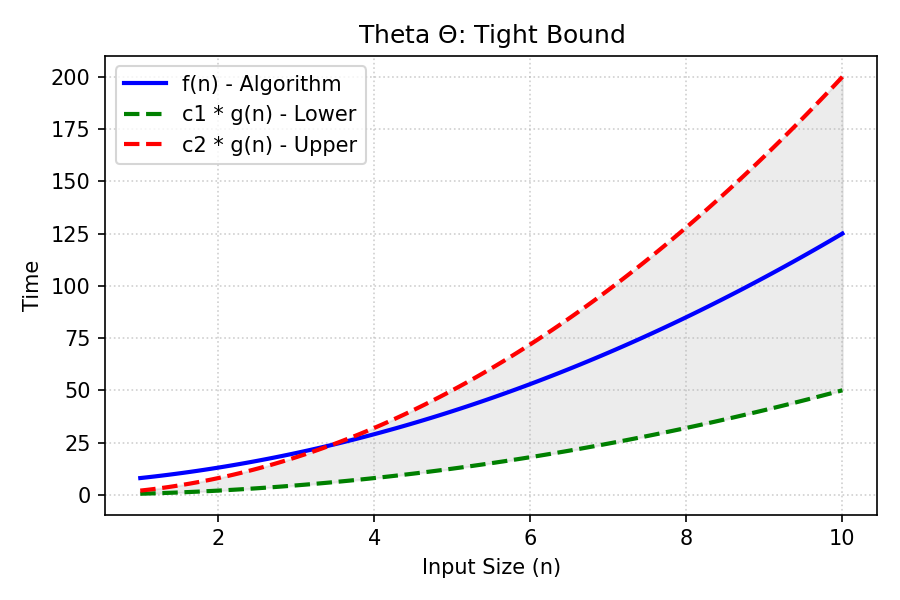

# Theta Notation

[⬅️ Back to Table of Contents](Table%20Of%20Contents.md)

---

## 🎥 Video Notes

### Theta Notation ($\Theta$) - The Exact/Tight Bound
**Theta notation** bounds a function from both above and below. 

**Definition:** 
$f(n) = \Theta(g(n))$ if there exist positive constants $c_1, c_2,$ and $n_0$ such that:
$0 \le c_1 \cdot g(n) \le f(n) \le c_2 \cdot g(n)$ for all $n \ge n_0$.

**What it means:**
An algorithm is $\Theta(g(n))$ if and only if it is both $O(g(n))$ **and** $\Omega(g(n))$. The function grows precisely at the same rate as the bound.

**Insight:** This is the most exact scientific statement you can make about growth rate. If time complexity is $\Theta(N^2)$, you know the time grows exclusively alongside a quadratic curve, neither notably faster nor slower.

