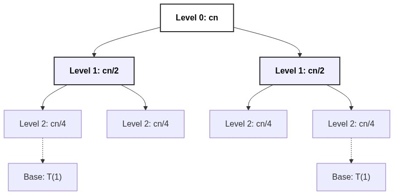

# Recursion Tree Method for Solving Recurrences

[⬅️ Back to Table of Contents](Table%20Of%20Contents.md)

---

## 🎥 Video Notes

### Solving Recurrences Graphically
The **Recursion Tree Method** is a visual way to solve recurrence relation equations like $T(n) = 2T(n/2) + cn$. 

#### How to construct and use the tree:
1.  **Draw the Root:** The root of the tree represents the cost of the first level (e.g., $cn$).
2.  **Draw the Branches:** Branch the tree downwards corresponding to the recursive calls (e.g., Two branches indicating $n/2$ inputs each).
3.  **Find the Cost per Level:** Add up the operational costs across each horizontal level of the tree.
4.  **Find the Depth:** Determine how many levels deeply the tree goes before hitting the base case ($n=1$).
5.  **Sum Total:** Total Time = Sum of costs of *all* horizontal levels!

**Example Application for Merge Sort:**

- Level 0 cost: $cn$
- Level 1 has two nodes of $cn/2$. Cost: $c(n/2) + c(n/2) = cn$
- Level 2 has four nodes of $cn/4$. Cost: $cn$
- Depth of tree halving by 2: $\log_2(n)$ levels.
- Total cost: $\log_2(n)$ levels all costing $cn \implies \Theta(N \log N)$.

