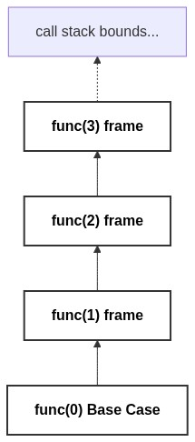

# Space Complexity

[⬅️ Back to Table of Contents](Table%20Of%20Contents.md)

---

## 🎥 Video Notes

### Space Complexity vs Auxiliary Space
Many confuse the total space an algorithm uses with its auxiliary space.
*   **Total Space Complexity:** Input Space + Auxiliary Space.
*   **Auxiliary Space:** The *extra/temporary* space used locally by an algorithm while running. 

When interviewing or evaluating code, we are almost always talking specifically about **Auxiliary Space Complexity**.

### Variables and Arrays
*   Declaring a few `int` variables: $O(1)$ Space.
*   Slicing/Copying an `int array[N]`: $O(N)$ Space.
*   Creating a grid `int matrix[N][N]`: $O(N^2)$ Space.

### The Hidden Space: Recursive Call Stacks
Even if you define no new variables inside a function, **Recursion consumes space**.
Every time a function calls itself, it must push its current state (parameters, return address) onto the Call Stack so it knows how to resume later.

If you have a function recursively call itself `N` times deep without resolving, the call stack will store `N` activation records. Thus, the Auxiliary Space is identically **$O(N)$**, even though you allocated no physical arrays!

