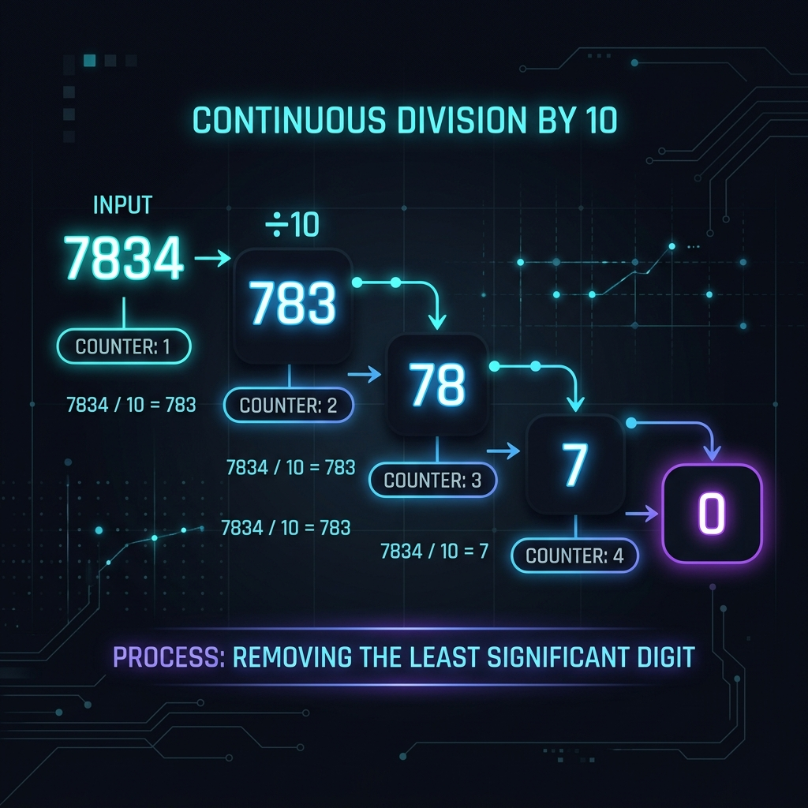

# Count Digits

[⬅️ Back to Table of Contents](00_Table_Of_Contents.md)

---

## 📄 Understanding the Logic

### What is the problem?
Given a number `N`, the task is to count the number of digits in `N`. For example:
- If `N = 12345`, the number of digits is `5`.
- If `N = 7`, the number of digits is `1`.
- If `N = 0`, arguably it has `1` digit depending on constraints, though usually positive integers are considered.

### How do we solve it?

There are 3 main approaches to solve this efficiently.

 

 

#### Method 1: Iterative Approach (Division by 10)
The most intuitive way is to keep chopping the last digit off the number until the number becomes `0`.
In base 10, dividing an integer by `10` removes the last digit. We keep a counter that increments every time we successfully divide by `10`.

**Time Complexity:** `O(d)` where `d` is the number of digits.
**Space Complexity:** `O(1)` constant space.

#### Method 2: Recursive Approach
We can define the logic recursively:
- Base case: If `N == 0`, return `0`.
- Recursive step: return `1 + countDigits(N / 10)`.

**Time Complexity:** `O(d)`
**Space Complexity:** `O(d)` due to the call stack.

#### Method 3: Logarithmic Approach (Best for Speed)
A mathematical property of numbers is that taking the base-10 logarithm of a number gives its magnitude. Specifically, the number of digits in `N` is `floor(log10(N)) + 1`.

**Time Complexity:** `O(1)` continuous algebraic calculation.
**Space Complexity:** `O(1)`

> [!TIP]
> The analytical logarithmic approach is incredibly fast `O(1)` and should be naturally considered in competitive programming when pure execution speed is needed.

---

### Step-by-Step Visualization of the Iterative Approach:
**Given N = 7834**
1. Iteration 1: `N = 7834 / 10` = `783`. `Count = 1`
2. Iteration 2: `N = 783 / 10` = `78`. `Count = 2`
3. Iteration 3: `N = 78 / 10` = `7`. `Count = 3`
4. Iteration 4: `N = 7 / 10` = `0`. `Count = 4`
Loop ends since `N == 0`. Final Answer = **4**.
