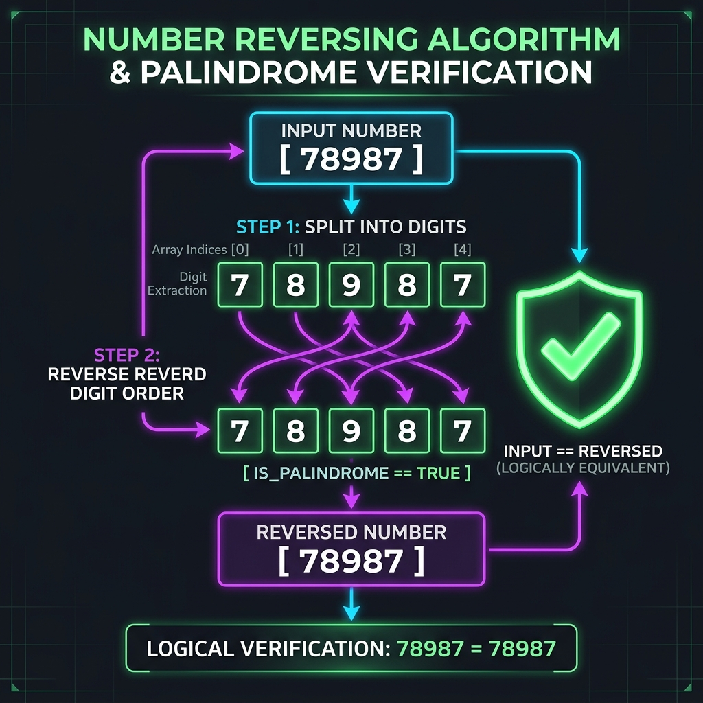

# Palindrome Numbers

[⬅️ Back to Table of Contents](00_Table_Of_Contents.md)

---

## 📄 Understanding the Logic

### What is a Palindrome Number?
A **palindrome** is a sequence of characters or numbers which reads the same backward as forward. 
For example:
- `121` is a palindrome.
- `78987` is a palindrome.
- `8668` is a palindrome.
- `456` is NOT a palindrome (because backward it is `654`).

### How do we solve it?

To check if a number mathematically forms a palindrome, the main logic is to **Reverse the Number** and check if the original number matches the reversed number.

 

 

#### Step-by-Step Mathematical Approach:
To reverse a number, we continuously extract its last digit and reconstruct it sequentially backward.

1. Create a variable `rev = 0` to store the reversed number.
2. Store the original number in a temporary variable e.g., `temp = N` (because `N` will be modified during the process).
3. Loop while `temp > 0`:
   - Extract the last digit: `lastDigit = temp % 10` (modulo operator gives the remainder).
   - Append to the reversed number: `rev = (rev * 10) + lastDigit`.
   - Remove the last digit from `temp`: `temp = temp / 10`.
4. Finally, compare `rev` with the original `N`. If `rev == N`, it is a palindrome!

#### Execution Visualized: `N = 121`
Initially `rev = 0`, `temp = 121`.

**Iteration 1:**
- `lastDigit = 121 % 10 = 1`
- `rev = (0 * 10) + 1 = 1`
- `temp = 121 / 10 = 12`

**Iteration 2:**
- `lastDigit = 12 / 10 = 2`
- `rev = (1 * 10) + 2 = 12`
- `temp = 12 / 10 = 1`

**Iteration 3:**
- `lastDigit = 1 % 10 = 1`
- `rev = (12 * 10) + 1 = 121`
- `temp = 1 / 10 = 0`

Loop ends! Now `rev == 121`. The original `N == 121`. Since they match, it is a Palindrome.

**Time Complexity:** `O(d)` where `d` is the number of digits in `N`.
**Space Complexity:** `O(1)` as we only need two auxiliary integers (`rev` and `temp`).

> [!WARNING]
> Keep an eye out for negative numbers! Generally, a negative number like `-121` reads backward as `121-`, meaning negative numbers are almost never palindromes mathematically. You can handle this gracefully by outright returning `false` if `N < 0`.

