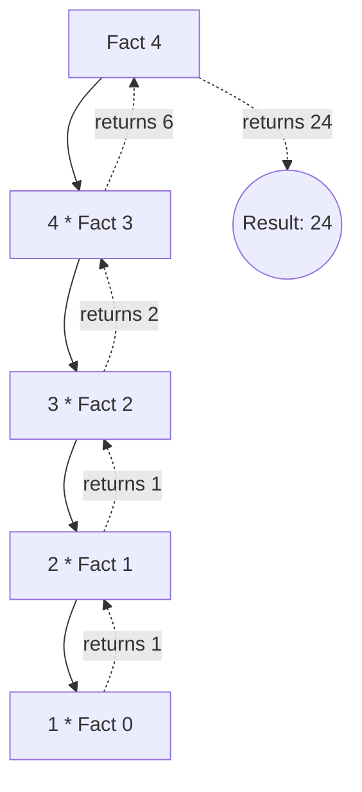

# Factorial of a Number

[⬅️ Back to Table of Contents](00_Table_Of_Contents.md)

---

## 📄 Understanding the Logic

### What is the Factorial?
The Factorial of a non-negative integer `N`, denoted by `N!`, is the product of all positive integers less than or equal to `N`.
*   Formula: $N! = N 	imes (N-1) 	imes (N-2) 	imes ... 	imes 1$
*   *Note: `0! = 1`.*

### How do we solve it?
We can reliably compute this in two distinct ways:

#### Method 1: Iterative
Use a standard loop counting from `2` up to `N` keeping the product.
```cpp
uint64_t factorial(int n) {
    uint64_t res = 1;
    for(int i = 2; i <= n; i++) res *= i;
    return res;
}
```

#### Method 2: Recursive
Utilise the recurrence relation functionally: $N! = N 	imes (N-1)!$
```cpp
uint64_t factorialRec(int n) {
    if (n == 0) return 1;
    return n * factorialRec(n - 1);
}
```

### 🧠 Logic Visualization



### 📊 Complexity Evaluation

| Approach | Time Complexity | Space Complexity | Notes |
| :--- | :--- | :--- | :--- |
| **Iterative** | `O(N)` | `O(1)` | **Optimal.** Scales safely without allocating memory. |
| **Recursive** | `O(N)` | `O(N)` | Has strict overheads dynamically mapping internal stackframes. |

> [!WARNING]
> Factorials organically grow exponentially fast mathematically! E.g. `20!` natively exceeds the 64-bit integer limit unconditionally in C++. Proceed with care computationally.
