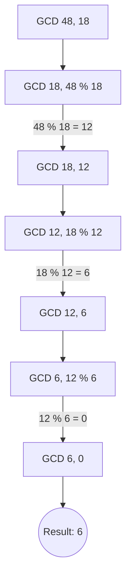

# GCD or HCF of two Numbers

[⬅️ Back to Table of Contents](00_Table_Of_Contents.md)

---

## 📄 Understanding the Logic

### Core Definition
The Greatest Common Divisor mathematically evaluates logically as the optimally massive integral which cleanly strictly divides both inputs `$A$` and `$B$`.

### Solution Algorithm: Euclidean Algorithm
The naive `O(min(a,b))` approach iterates from the base upwards. However, structurally utilizing the mathematical property: **$GCD(A, B) = GCD(B, A\%B)$**, yields tremendously faster execution dynamically.

#### Implementation (Recursive Euclidean)
```cpp
int gcd(int a, int b) {
    if (b == 0) return a;
    return gcd(b, a % b); 
}
```

### 🧠 Logic Visualization



### 📊 Complexity Evaluation

| Approach | Time Complexity | Space Complexity | Summary |
| :--- | :--- | :--- | :--- |
| **Naive Loop** | `O(min(A,B))` | `O(1)` | Too slow natively mathematically for strictly huge bounds. |
| **Euclidean Algorithm** | `O(log(min(A,B)))` | `O(log(min(A,B)))` | Optimal recursively shifting dynamically decreasing residues. |
