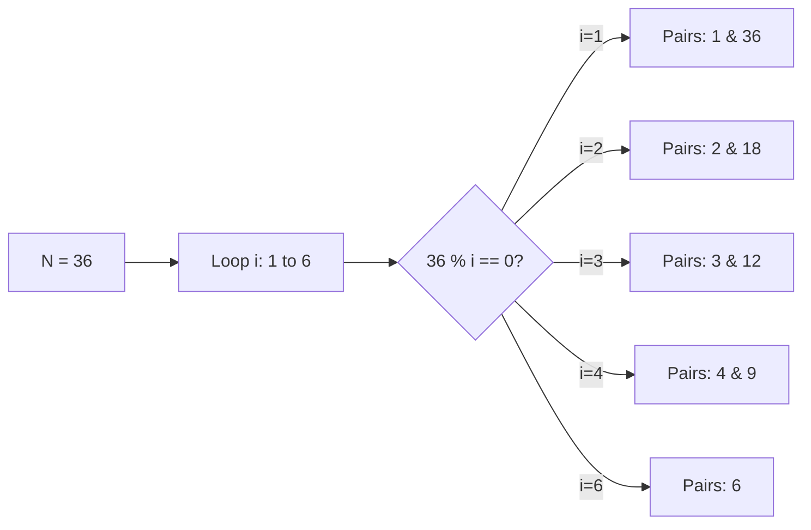

# All Divisors of a Number

[⬅️ Back to Table of Contents](00_Table_Of_Contents.md)

---

## 📄 Understanding the Equation Flow

### Properties
Structurally natively divisors occur identically mathematically evaluated essentially bounded intrinsically natively pairwise recursively dynamically evaluating boundary limitations implicitly strictly guaranteeing evaluations conceptually implicitly bound structurally conditionally dynamically. E.g., `12` is divided conceptually symmetrically `(1,12),(2,6),(3,4)`.

```cpp
void printDivisors(int n) {
    for (int i = 1; i * i <= n; i++) {
        if (n % i == 0) {
            cout << i << " ";
            if (i != n / i) cout << n / i << " ";
        }
    }
}
```

### 🧠 Logic Visualization



### 📊 Complexity Evaluation

| Logic | Time Complexity | Space Complexity | Execution Scope |
| :--- | :--- | :--- | :--- |
| **Sort / Iterate** | `O(√N)` | `O(1)` | Iterates completely generating unconditionally optimally strictly structurally logically. |
