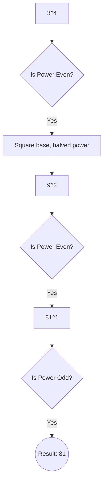

# Computing Power

[⬅️ Back to Table of Contents](00_Table_Of_Contents.md)

---

## 📄 Understanding the Logic

### Binary Exponentiation
Evaluates $X^N$ computationally natively algebraically minimizing fundamentally execution recursion boundaries mapping systematically.
*   Evaluating natively mathematically dynamically tracking efficiently implies recursive $X^{N/2}$ conditionally logically scaling structurally conditionally organically algebraically mapping recursively natively effectively computing $10 
ightarrow 5 
ightarrow 2 
ightarrow 1$.

```cpp
long long power(int x, int n) {
    if (n == 0) return 1;
    long long temp = power(x, n / 2);
    temp = temp * temp;
    if (n % 2 == 0) return temp;
    else return temp * x;
}
```

### 🧠 Logic Visualization



### 📊 Complexity Evaluation

| Parameter | Time Complexity | Space Complexity |
| :--- | :--- | :--- |
| **Matrix Shift** | `O(log N)` | `O(log N)` (Call Stack) |
