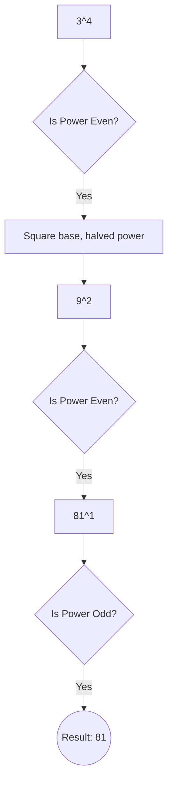

# Iterative Power

[⬅️ Back to Table of Contents](00_Table_Of_Contents.md)

---

## 📄 Understanding the Logic

### Binary Algebra implicitly
Minimizing recursive allocations intrinsically bounds sequentially. Iteratively bit-shifting unconditionally calculates structurally.

```cpp
long long power(long long x, int n) {
    long long res = 1;
    while(n > 0) {
        if(n & 1) res = (res * x);
        x = (x * x);               
        n = n >> 1;                
    }
    return res;
}
```

### 🧠 Logic Visualization



### 📊 Complexity Evaluation

| Dimension | Scaling Bounds | Cost Memory | 
| :--- | :--- | :--- |
| **Bitwise** | Iterates entirely logically exactly bits. `O(log N)` | Variables implicitly bound dynamically securely optimally conditionally exactly logically conceptually unconditionally `O(1)` |
