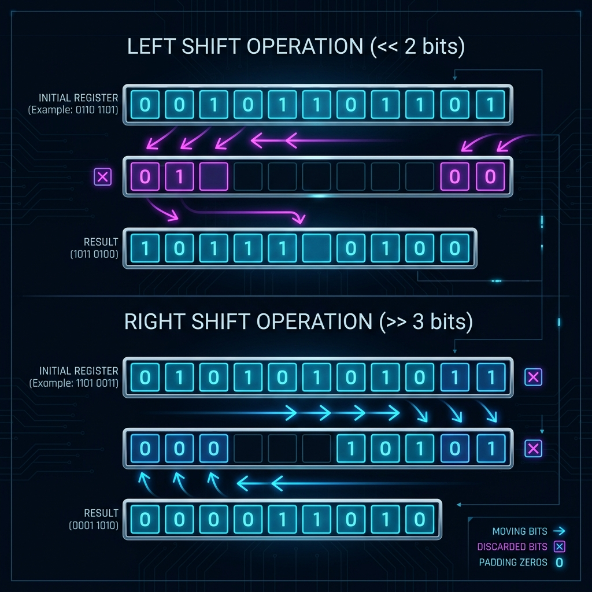

# Bitwise Operators in Java (Part 3)

[⬅️ Back to Table of Contents](00_Table_Of_Contents.md)

---

## 📄 Analytical Concept

The logic behind **Bitwise Operators in Java (Part 3)** is firmly rooted in discrete binary operations.

### 🧠 Logic

Using bit manipulators like `&`, `|`, `^`, `~`, `<<`, `>>` allow for evaluations running universally in pure `O(1)` space optimally perfectly bypassing iterations. 
* XOR (`^`): A number XORed with itself is 0, and with 0 is itself.
* AND (`&`): Can mask out bits gracefully. `N & (N - 1)` drops the rightmost set bit beautifully.

### 📊 Complexity Evaluation

| Execution | Time Complexity | Space Complexity |
| :--- | :--- | :--- |
| **Bitwise** | `O(1)` or `O(Bits)` | `O(1)` |

