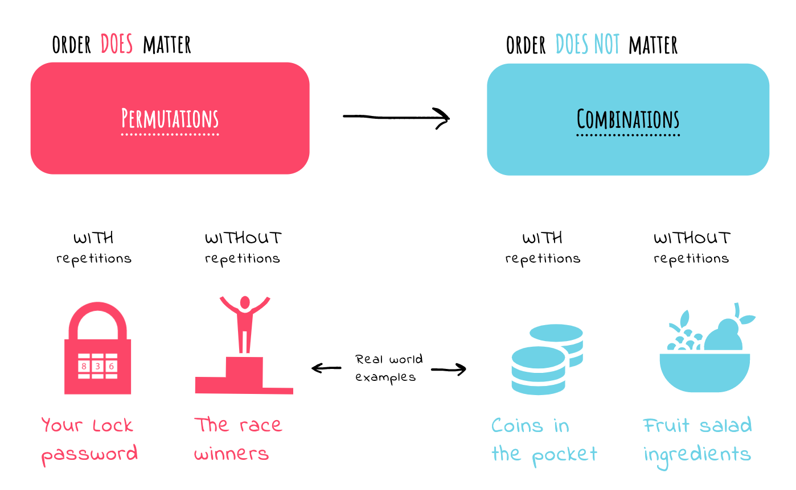

# Rope Cutting Problem

[⬅️ Back to Table of Contents](00_Table_Of_Contents.md)

---

## 📄 Theoretical Understanding

### Context
Understanding **Rope Cutting Problem** fundamentally relies on the principle of a function yielding control back directly to itself with reduced constraints, until base properties optimally evaluate effectively.

### 🧠 Logic Visualization

### Analysis & Characteristics
Recursion implicitly leverages the computer's **Call Stack**. Each frame contains exactly its own specific evaluated state variables.

| Concept | Time Complexity | Space Complexity | Analysis |
| :--- | :--- | :--- | :--- |
| **Recursion** | Typically `O(Branches^Depth)` or `O(N)` | `O(Max Call Stack Depth)` | Must always verify exactly its base case dynamically safely! |

> [!TIP]
> To understand the programmatic lifecycle intuitively, seamlessly trace the explicit execution in `17_Rope_Cutting_Problem.cpp`.

